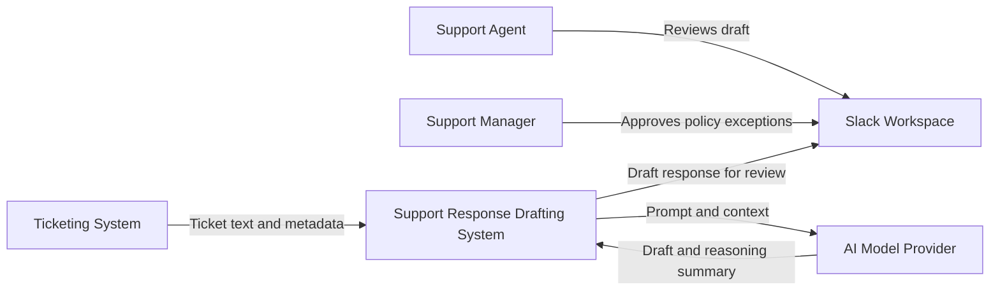
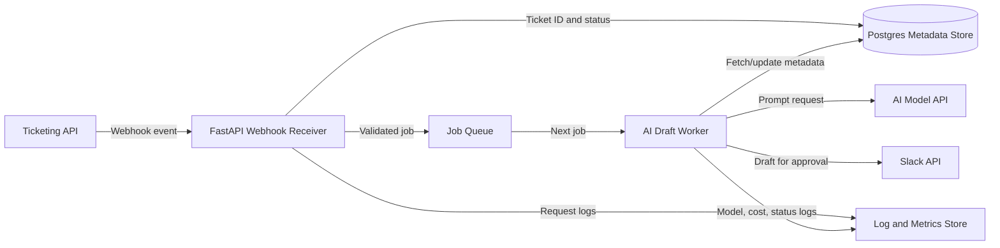
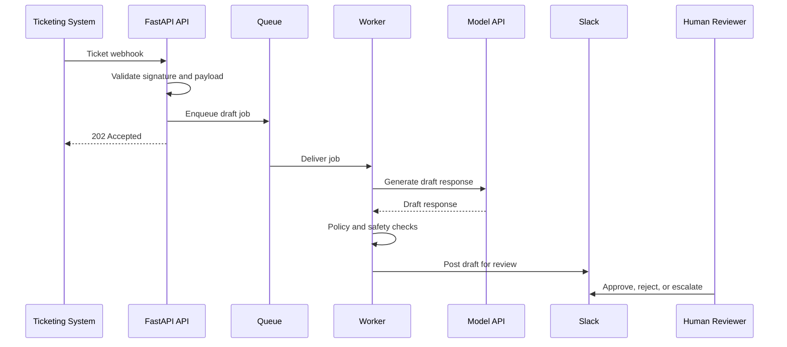
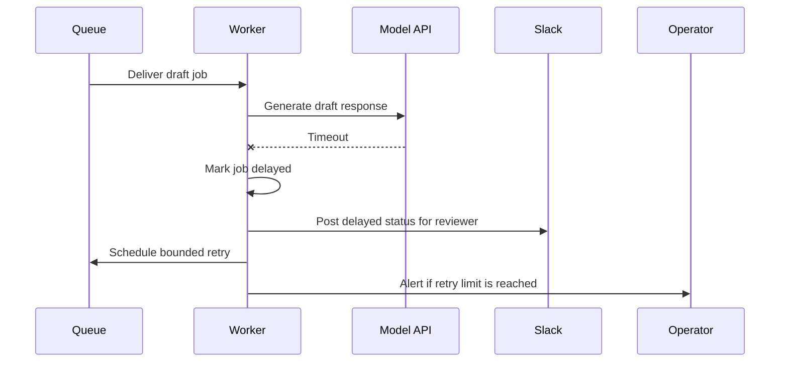
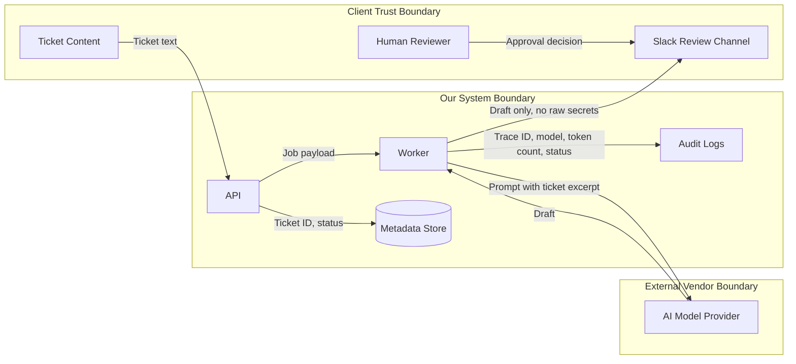

# Lesson 05.02: Architecture Diagrams That Explain the System

**Parent syllabus:** [Syllabus 05: AI System Architecture](../../syllabus-05-ai-system-architecture.md)  
**Estimated time:** 2-3 hours  
**Artifact:** AI system diagram pack

---

## Outcome

By the end of this lesson, you can create a small diagram pack that explains an AI system from four angles:

- System context
- Containers and deployable parts
- Multi-step workflow sequence
- Data flow and trust boundaries

The point is not to make impressive diagrams. The point is to make the system understandable enough that someone can review, question, operate, and improve it.

---

## Why This Matters

Bad diagrams create false confidence.

Common failures:

- The diagram shows the model but not the data stores.
- The diagram shows components but not who uses them.
- The diagram shows arrows but not what moves across them.
- The diagram hides where sensitive data crosses trust boundaries.
- The diagram is so detailed that nobody updates it.
- The diagram is decorative and cannot support a technical decision.

Architecture diagrams should answer review questions. If a diagram does not answer a question, remove it or replace it.

---

## Best-Practice Principles

1. **One diagram, one question.**  
   Do not force one image to explain everything. Use different views for different review needs.

2. **Use C4 levels to control detail.**  
   Start with context, then containers, then components only when needed. Code-level diagrams are rarely useful early.

3. **Label every relationship.**  
   A line without a label is a guess. Name what crosses the line: request, document, token stream, webhook, embedding, approval, audit log.

4. **Show humans, not just software.**  
   AI systems have users, approvers, operators, admins, and people affected by mistakes.

5. **Draw data movement explicitly.**  
   Privacy and security review depends on knowing where data enters, where it is stored, where it leaves, and where it is deleted.

6. **Mark trust boundaries.**  
   Make it visible when data moves between your system, client systems, model providers, cloud services, and user devices.

7. **Keep diagrams maintainable.**  
   A diagram that cannot survive the next architecture change is not a useful artifact.

---

## Concepts

### C4 Context Diagram

Shows the system in its environment: users, external systems, model providers, client tools, and high-level dependencies.

Use it to answer:

- Who uses this?
- What does it connect to?
- What is inside vs. outside our responsibility?

### C4 Container Diagram

Shows the deployable or runtime parts inside the system.

Examples:

- FastAPI backend
- Worker process
- Queue
- Postgres database
- Vector database
- Object storage
- Admin dashboard

Use it to answer:

- What runs where?
- What stores data?
- What calls what?

### Component Diagram

Shows the major internal modules inside one container.

Examples inside an AI API:

- Auth middleware
- Request validator
- Orchestrator
- Retrieval service
- Model client
- Policy checker
- Audit logger

Use this only when the container is complex enough to need internal explanation.

### Sequence Diagram

Shows the order of events across actors and services.

Use it to answer:

- What happens first?
- Where can the flow pause?
- Where are retries, timeouts, handoffs, and errors?

### Data-Flow Diagram

Shows data movement, storage, transformation, and trust boundaries.

Use it to answer:

- What sensitive data enters the system?
- Where is it stored?
- Who can access it?
- Where does it leave the system?
- What is logged?

---

## Walkthrough

Use this example:

> A support response drafting system reads support tickets, drafts replies with an AI model, checks policy, and posts drafts to Slack for human approval.

### Diagram 1 - Context

Review question:

> Can a non-technical stakeholder understand who uses the system and what external services it depends on?

### Diagram 2 - Container

Review question:

> Can an engineer identify what runs, what stores data, and where failures can happen?

### Diagram 3 - Sequence

Review question:

> Can someone see where the system returns quickly, where the slow work happens, and where human review occurs?

### Failure-path add-on

Do not stop at the happy path. Add at least one failure path to the same sequence or as a companion diagram.

Review question:

> Can someone see what the system does when the model provider times out, and who is notified if the retry limit is reached?

### Diagram 4 - Data Flow and Trust Boundaries

Review question:

> Can a privacy or security reviewer see where client data crosses boundaries?

---

## Practice

Pick one AI workflow you want to build.

Create four diagrams:

1. **Context diagram** - users, external systems, model provider, and your system.
2. **Container diagram** - runtime pieces, data stores, queues, APIs, workers, and logs.
3. **Sequence diagram** - the main happy path plus one failure path.
4. **Data-flow diagram** - sensitive data, storage, logging, external providers, and trust boundaries.

Use Mermaid, Excalidraw, Structurizr, draw.io, or plain boxes and arrows. The tool does not matter. The clarity does.

---

## Review Checklist

Your diagram pack is acceptable when:

- Every diagram has a title and purpose.
- Every box has a clear name.
- Every arrow has a label.
- The system boundary is visible.
- External systems are distinct from owned components.
- Human actors are shown.
- At least one trust boundary is shown.
- Sensitive data movement is visible.
- Slow or asynchronous work is visible.
- Human approval points are visible.
- A reviewer can tell what is intentionally not automated.

---

## Common Failure Modes

- **Everything diagram:** One giant diagram tries to show all details at once.
- **Unlabeled arrows:** Reviewers cannot tell what data or action crosses a line.
- **No trust boundary:** Client systems, your system, and vendors all look the same.
- **Missing humans:** The diagram forgets reviewers, operators, admins, or affected users.
- **Model-only view:** The model is shown but not storage, auth, logs, queues, or handoff.
- **No failure path:** The diagram only shows the ideal path.
- **Tool worship:** The diagram looks polished but does not answer review questions.

---

## Portfolio Evidence

Save:

- The four-diagram pack
- A short note explaining what each diagram is for
- One sanitized version safe to show publicly

These diagrams become part of your capstone architecture package.

---

## References

- C4 model official site: https://c4model.com/
- C4 model diagram review checklist: https://c4model.com/diagrams/checklist
- NIST AI Risk Management Framework: https://www.nist.gov/itl/ai-risk-management-framework
- OWASP Top 10 for LLM Applications: https://owasp.org/www-project-top-10-for-large-language-model-applications/
